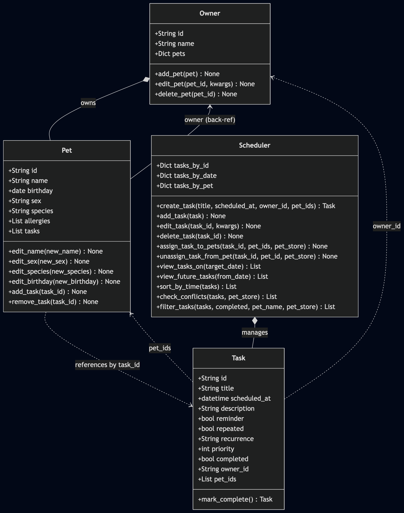

# Weekly TF Task 4

The core concept students needed to understand is to implemented client requirement into a complete application using AI. Students are most likely to struggle balancing the number of attributes and methods needing to function. The AI was helpful in creating the ULM, code skeleton and implementing the methods. However, it was struggling in helping with the UI and streamlit session. I had some misconceptions about the script rerun and page refresh (should be emphasised to students). One way I would guide a student without giving the answer is to encourage them to keep to stay curious and in control of the AI, take it step by step to not feel overwhelmed. 

# PawPal+ (Module 2 Project)

You are building **PawPal+**, a Streamlit app that helps a pet owner plan care tasks for their pet.

## Scenario

A busy pet owner needs help staying consistent with pet care. They want an assistant that can:

- Track pet care tasks (walks, feeding, meds, enrichment, grooming, etc.)
- Consider constraints (time available, priority, owner preferences)
- Produce a daily plan and explain why it chose that plan

Your job is to design the system first (UML), then implement the logic in Python, then connect it to the Streamlit UI.

## Features

| Feature | Where | Description |
| --- | --- | --- |
| **Owner & pet management** | `Owner`, `Pet` | Create an owner, add pets with name / species / birthday. Owner holds pets in a keyed dictionary; `add_pet()` sets a back-reference so each `Pet` knows its `Owner`. |
| **Task creation** | `Scheduler.create_task()` | Creates a `Task` with title, datetime, priority, description, reminder flag, and assigned pet IDs. The scheduler indexes every task by ID, date, and pet for fast lookups. |
| **Assign tasks to pets** | `Scheduler.assign_task_to_pets()` | Links a task to one or more pets at once, updating both the scheduler's index and each pet's own task-ID list. |
| **Unassign a task from a pet** | `Scheduler.unassign_task_from_pet()` | Removes the link between a task and a specific pet without deleting the task from the scheduler. |
| **Sorting by time** | `Scheduler.sort_by_time()` | Returns tasks in ascending `scheduled_at` order regardless of insertion order, using a single-key sort on the datetime field. |
| **Daily & weekly recurrence** | `Task.mark_complete()` | Completing a recurring task (`recurrence="daily"` or `"weekly"`) produces a new `Task` shifted by exactly 1 day or 7 days, with all original fields preserved and a fresh unique ID. |
| **Non-recurring task completion** | `Task.mark_complete()` | For non-recurring tasks `mark_complete()` sets `completed = True` and returns `None` — no follow-up task is created. |
| **Conflict warnings** | `Scheduler.check_conflicts()` | Scans a task list for exact `scheduled_at` matches and returns human-readable warning strings. Distinguishes *same-pet conflicts* (two tasks for the same animal at the same time) from *cross-pet conflicts* (different animals, same slot). Never raises — warnings are returned for the caller to display. |
| **Filtering** | `Scheduler.filter_tasks()` | Narrows a task list by completion status, assigned pet name, or both. Does not mutate the scheduler — returns a filtered copy. |
| **View tasks by date** | `Scheduler.view_tasks_on()` | Returns all tasks scheduled on a specific date using the date index — O(1) lookup instead of scanning every task. |
| **View future tasks** | `Scheduler.view_future_tasks()` | Returns all tasks scheduled after a given date by iterating only over date-indexed buckets. |
| **Interactive schedule UI** | `app.py` — Build Schedule | User picks a date, optional pet filter, and completion filter. The app fetches, filters, sorts, and displays tasks in a table, surfaces any conflict warnings, and provides per-task "Mark complete" buttons that handle recurrence automatically. |

## What you will build

Your final app should:

- Let a user enter basic owner + pet info
- Let a user add/edit tasks (duration + priority at minimum)
- Generate a daily schedule/plan based on constraints and priorities
- Display the plan clearly (and ideally explain the reasoning)
- Include tests for the most important scheduling behaviors

## Smarter Scheduling

Three features were added to `Scheduler` and `Task` to make scheduling more intelligent:

**Recurring tasks** — `Task` gains a `recurrence` field (`"daily"` or `"weekly"`). When `mark_complete()` is called on a recurring task it returns a new `Task` instance scheduled for the next occurrence (tomorrow or next week), preserving all original fields. The caller registers it with the scheduler via `add_task()`.

**Sorting** — `sort_by_time(tasks)` returns a list of tasks ordered by `scheduled_at`, regardless of the order they were created or added.

**Filtering** — `filter_tasks(tasks, completed=..., pet_name=..., pet_store=...)` narrows a task list by completion status, assigned pet name, or both. Returns a filtered list without modifying the scheduler.

**Conflict detection** — `check_conflicts(tasks, pet_store=...)` scans for tasks sharing an exact `scheduled_at` datetime and returns a list of human-readable warning strings. It distinguishes between same-pet conflicts (two tasks for the same animal at the same time) and cross-pet conflicts (different animals, same time slot). The program never crashes — warnings are returned for the caller to display.

> **Known tradeoff:** conflicts are detected by exact minute match. Two tasks with overlapping durations (e.g. 09:00–09:30 and 09:15–09:45) will not be flagged unless a `duration` field is added and range comparison is used.

## Testing PawPal+

### Run the tests

```bash
python -m pytest tests/test_pawpal.py -v
```

### What the tests cover

| Test | What it verifies |
| --- | --- |
| `test_task_completion` | A task starts incomplete and is marked complete after `mark_complete()` |
| `test_task_addition_to_pet` | Adding a task ID to a pet updates its task list correctly |
| `test_sort_by_time_chronological_order` | `sort_by_time()` returns tasks in ascending `scheduled_at` order regardless of insertion order |
| `test_daily_recurrence_creates_next_day_task` | Completing a `recurrence="daily"` task returns a new task scheduled exactly 1 day later, with all fields preserved |
| `test_daily_recurrence_new_task_has_different_id` | The recurrence-spawned task receives a fresh unique ID |
| `test_no_recurrence_returns_none` | `mark_complete()` returns `None` for non-recurring tasks |
| `test_conflict_detection_same_time` | Two tasks at the same datetime produce exactly one conflict warning containing both task titles |
| `test_conflict_detection_no_conflict` | Tasks at different times produce no warnings |
| `test_conflict_detection_same_pet_conflict` | Two same-time tasks sharing a pet produce a "Same-pet conflict" warning with the pet's name |

### Confidence Level

### ★★★★☆ (4/5)

All 9 tests pass. Core behaviors — task lifecycle, daily recurrence, chronological sorting, and conflict detection — are verified and working correctly. The one-star deduction reflects a known gap: conflicts are only detected on exact `scheduled_at` matches. Tasks with overlapping durations (e.g. 09:00–09:30 and 09:15–09:45) are not flagged, as noted in the tradeoffs section below.

---

## Getting started

### Setup

```bash
python -m venv .venv
source .venv/bin/activate  # Windows: .venv\Scripts\activate
pip install -r requirements.txt
```

### Suggested workflow

1. Read the scenario carefully and identify requirements and edge cases.
2. Draft a UML diagram (classes, attributes, methods, relationships).
3. Convert UML into Python class stubs (no logic yet).
4. Implement scheduling logic in small increments.
5. Add tests to verify key behaviors.
6. Connect your logic to the Streamlit UI in `app.py`.
7. Refine UML so it matches what you actually built.


## Demo


 
