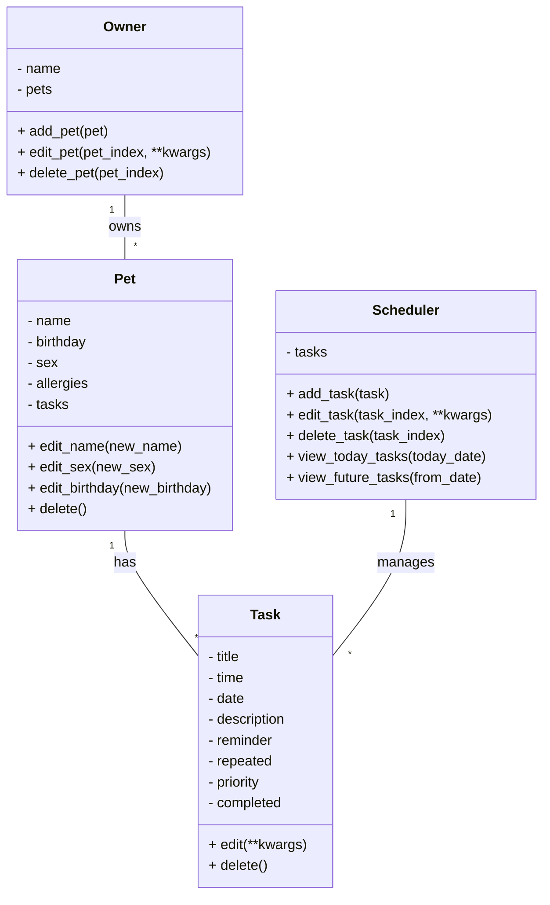

```mermaid
classDiagram
    class Owner {
        - name
        - pets
        + add_pet(pet)
        + edit_pet(pet_index, **kwargs)
        + delete_pet(pet_index)
    }
    class Pet {
        - name
        - birthday
        - sex
        - allergies
        - tasks
        + edit_name(new_name)
        + edit_sex(new_sex)
        + edit_birthday(new_birthday)
        + delete()
    }
    class Task {
        - title
        - time
        - date
        - description
        - reminder
        - repeated
        - priority
        - completed
        + edit(**kwargs)
        + delete()
    }
    class Scheduler {
        - tasks
        + add_task(task)
        + edit_task(task_index, **kwargs)
        + delete_task(task_index)
        + view_today_tasks(today_date)
        + view_future_tasks(from_date)
    }

    Owner "1" -- "*" Pet : owns
    Pet "1" -- "*" Task : has
    Scheduler "1" -- "*" Task : manages
```
