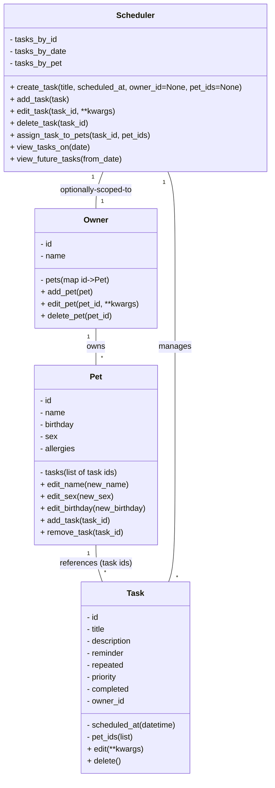

```mermaid
classDiagram
    class Owner {
        - id
        - name
        - pets (map id->Pet)
        + add_pet(pet)
        + edit_pet(pet_id, **kwargs)
        + delete_pet(pet_id)
    }
    class Pet {
        - id
        - name
        - birthday
        - sex
        - allergies
        - tasks (list of task ids)
        + edit_name(new_name)
        + edit_sex(new_sex)
        + edit_birthday(new_birthday)
        + add_task(task_id)
        + remove_task(task_id)
    }
    class Task {
        - id
        - title
        - scheduled_at (datetime)
        - description
        - reminder
        - repeated
        - priority
        - completed
        - owner_id
        - pet_ids (list)
        + edit(**kwargs)
        + delete()
    }
    class Scheduler {
        - tasks_by_id
        - tasks_by_date
        - tasks_by_pet
        + create_task(title, scheduled_at, owner_id=None, pet_ids=None)
        + add_task(task)
        + edit_task(task_id, **kwargs)
        + delete_task(task_id)
        + assign_task_to_pets(task_id, pet_ids)
        + view_tasks_on(date)
        + view_future_tasks(from_date)
    }

    Owner "1" -- "*" Pet : owns
    Pet "1" -- "*" Task : references (task ids)
    Scheduler "1" -- "*" Task : manages
    Scheduler "1" -- "1" Owner : optionally-scoped-to
```
