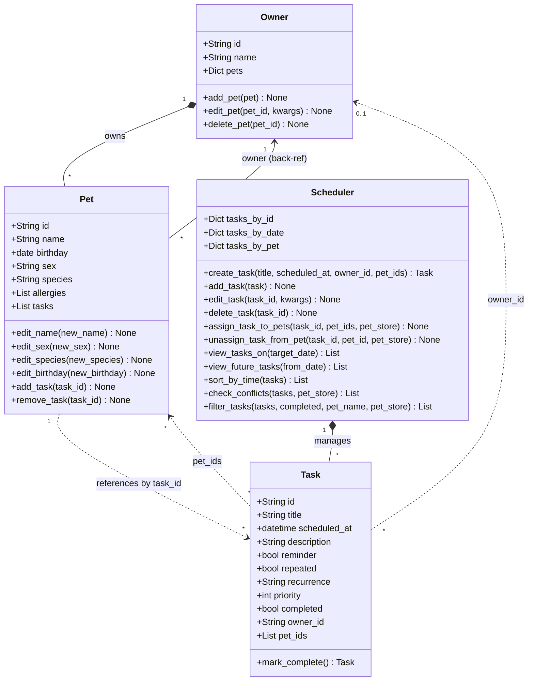

```mermaid
classDiagram
    class Owner {
        +String id
        +String name
        +Dict pets
        +add_pet(pet) None
        +edit_pet(pet_id, kwargs) None
        +delete_pet(pet_id) None
    }

    class Pet {
        +String id
        +String name
        +date birthday
        +String sex
        +String species
        +List allergies
        +List tasks
        +edit_name(new_name) None
        +edit_sex(new_sex) None
        +edit_species(new_species) None
        +edit_birthday(new_birthday) None
        +add_task(task_id) None
        +remove_task(task_id) None
    }

    class Task {
        +String id
        +String title
        +datetime scheduled_at
        +String description
        +bool reminder
        +bool repeated
        +String recurrence
        +int priority
        +bool completed
        +String owner_id
        +List pet_ids
        +mark_complete() Task
    }

    class Scheduler {
        +Dict tasks_by_id
        +Dict tasks_by_date
        +Dict tasks_by_pet
        +create_task(title, scheduled_at, owner_id, pet_ids) Task
        +add_task(task) None
        +edit_task(task_id, kwargs) None
        +delete_task(task_id) None
        +assign_task_to_pets(task_id, pet_ids, pet_store) None
        +unassign_task_from_pet(task_id, pet_id, pet_store) None
        +view_tasks_on(target_date) List
        +view_future_tasks(from_date) List
        +sort_by_time(tasks) List
        +check_conflicts(tasks, pet_store) List
        +filter_tasks(tasks, completed, pet_name, pet_store) List
    }

    %% Owner holds Pet objects in its pets dict
    Owner "1" *-- "*" Pet : owns

    %% Pet.owner is set back by Owner.add_pet()
    Pet "*" --> "1" Owner : owner (back-ref)

    %% Scheduler is the authoritative store of Task objects
    Scheduler "1" *-- "*" Task : manages

    %% Pet stores task IDs only (no Task objects)
    Pet "1" ..> "*" Task : references by task_id

    %% Task stores owner_id and pet_ids (string references, not objects)
    Task "*" ..> "0..1" Owner : owner_id
    Task "*" ..> "*" Pet : pet_ids
```
